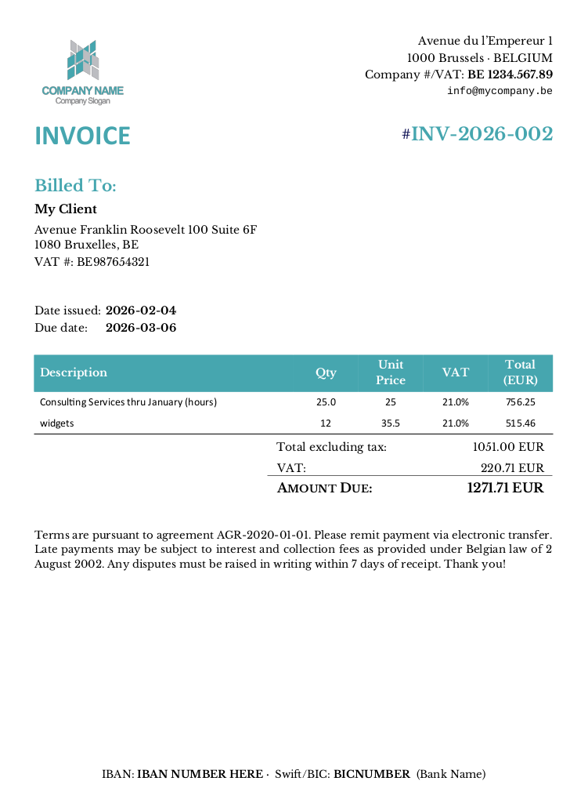

# Peppol-Compatible Invoicing

A Python library for generating EN16931-compliant e-invoices and human-readable PDF invoices, suitable for freelancers and small businesses operating in the EU.

Since January 2026, Belgian B2B invoices must be issued as structured e-invoices conforming to the [EN16931](https://ec.europa.eu/digital-building-blocks/sites/display/DIGITAL/EN16931) European standard. Commercial invoicing platforms charge ongoing fees for this. This library provides a free, open-source alternative: generate both the machine-readable XML e-invoice and a matching human-readable PDF, with correct VAT handling for domestic, intra-EU, and international clients.

**Caveat:** The authors are not accountants or tax advisors -- you are responsible for ensuring your invoices comply with applicable tax laws and regulations, and reflect your actual business transactions. If you are unsure about any aspect of your invoice, contact a professional.

### Features

- **EN16931 / UBL 2.1 / PEPPOL BIS 3.0** compliant XML e-invoice generation
- **Human-readable DOCX/PDF invoices** from customizable Word templates
  - This function may also be used standalone, even for non-EU businesses not interested in Peppol or VAT handling
- **Automatic VAT determination**: standard rated (domestic), reverse charge (intra-EU), or out-of-scope (non-EU)
- **PDF embedding** into the XML e-invoice for a single self-contained file
- **UBL schema validation** of generated invoices
- **Payment means support**: SEPA credit transfer, ACH/wire
- **Configurable** seller VAT rate for non-Belgian EU sellers

## How it works

Invoices are created in two forms: DOCX/PDF for humans and XML for machine-processing (and potential submission via PEPPOL).

1. **Human-readable invoices** are generated by `docx_invoice.py` from Word templates in the `templates/` directory. Templates use simple placeholders like `[CLIENT_NAME]` and `[SUBTOTAL]` that get filled in automatically. Conversion from DOCX to PDF requires [LibreOffice](https://www.libreoffice.org) to be installed.
2. **Machine-readable XML e-invoices** are generated by `en16931_invoice.py`. These comply with EN16931 and are suitable for PEPPOL transmission or email delivery. PDFs of human-readable invoices can optionally be embedded into the XML.

E-invoices are required for B2B transactions with Belgian customers as of January 2026. They are encouraged to be sent via PEPPOL, although other secure mechanisms are possible (email apparently doesn't qualify). Such invoices can also be sent to non-Belgian customers (e.g., by email), though e-invoices are not required outside Belgium.

Typically a script should be created for each customer, which generates the invoices for that customer.

- `examples/example_invoice.py` does this for a fictitious customer, and can serve as an example for other customers.
  In this high-level script, details of the customer, the seller, and the relevant contract are defined. Some aspects of the seller may vary by buyer (such as payment details).

  Be sure to set the correct VAT rate if you are not in Belgium or your client is not taxable at the standard rate of 21%.

  This example script works very simply. You provide the number of hours to be invoiced, and (optionally) the total copyright royalties to be charged, and the invoice is created in both forms, the PDF is embedded in the XML, and the XML is (partly) validated. The invoice number is inferred from previous invoices, the date is today, and the billing period is also inferred from the date. VAT is determined automatically based on the buyer and seller countries.

  Usage:
  ```bash
  python3 examples/example_invoice.py <hours_worked> [delivery_royalties (0)]
  ```

All invoices are placed in the `invoices/` subdirectory.

Final PEPPOL/UBL/EN16931 validation (including against business rules) can be done online:

- <https://app.b2brouter.net/en/validation>
- <https://ecosio.com/en/peppol-and-xml-document-validator/> with "OpenPeppol UBL Invoice (2025.5) (aka BIS Billing 3.0.19)" (or more recent) rule set

`peppol_invoice_sending.py` contains experimental code for sending XML invoices via a PEPPOL Access Point. This is untested and serves as a starting point. For production PEPPOL sending, consider [peppol-py](https://github.com/iterasdev/peppol-py) or a commercial Access Point provider.

Invoices can also be validated manually via `validate_invoice.py`.

The invoicing code handles VAT for domestic, intra-EU (reverse charge), and non-EU (out of scope) scenarios. The seller's standard domestic VAT rate defaults to Belgium's 21% but can be overridden via `seller_data['standard_vat_rate']`. Line items can be hourly (by using unit_code `HUR`), lump sum / fixed fee (unit_code `C62`, the default), or other UN/ECE Rec 20 unit codes. 'EA' is the default if quantity is provided, and if not, the line item is assumed to be unitless. An optional per-line invoice period (`period_start`, `period_end`) can be specified for retainers or fixed-fee services.

Unusual customer street addresses (like PO Boxes) may need code changes to work perfectly.

#### Requirements

```bash
pip install peppol-invoicing
```

[LibreOffice](https://www.libreoffice.org/download/download/) must be installed for DOCX-to-PDF conversion.


## Example outputs

XML e-Invoices like:
```xml
<?xml version='1.0' encoding='UTF-8'?>
<Invoice xmlns="urn:oasis:names:specification:ubl:schema:xsd:Invoice-2" xmlns:cac="urn:oasis:names:specification:ubl:schema:xsd:CommonAggregateComponents-2" xmlns:cbc="urn:oasis:names:specification:ubl:schema:xsd:CommonBasicComponents-2">
  <cbc:CustomizationID>urn:cen.eu:en16931:2017#compliant#urn:fdc:peppol.eu:2017:poacc:billing:3.0</cbc:CustomizationID>
  <cbc:ProfileID>urn:fdc:peppol.eu:2017:poacc:billing:01:1.0</cbc:ProfileID>
  <cbc:ID>INV-2026-002</cbc:ID>
  <cbc:IssueDate>2026-02-04</cbc:IssueDate>
  <cbc:DueDate>2026-03-06</cbc:DueDate>
  <cbc:InvoiceTypeCode>380</cbc:InvoiceTypeCode>
  <cbc:DocumentCurrencyCode>EUR</cbc:DocumentCurrencyCode>
  <cac:InvoicePeriod>
    <cbc:StartDate>2026-01-01</cbc:StartDate>
    <cbc:EndDate>2026-01-31</cbc:EndDate>
    <cbc:Description>Services thru January</cbc:Description>
  </cac:InvoicePeriod>
  ...
</Invoice>
```

Human-friendly invoices based on fully-customizable templates, like:



## VAT Rounding

Starting January 2026, Belgian e-invoicing rules require that VAT rounding only be applied to the total amount per VAT rate, not per line. This library follows this rule: line extension amounts (subtotals) are rounded per line, but VAT is calculated and rounded once per VAT rate at the document level. Line-level TaxTotal elements are omitted from the XML as they are optional in EN16931/UBL and could create rounding discrepancies.

## Limitations

- **Validation**: The library validates against UBL 2.1 schema but not against EN16931 business rules (~150 rules) or PEPPOL-specific rules. Always validate invoices with an external validator (see links above) before use in production.
- **VAT exemption text**: The default exemption reasons reference Belgian VAT Code articles. Sellers in other countries may need to customize these via the `reason` field in VAT details.
- **Single VAT rate per invoice**: All line items receive the same VAT treatment (determined by buyer/seller countries). Mixed VAT rates on a single invoice are not currently supported.
- **No prepayments or allowances**: Prepaid amounts, deposits, and document-level allowances/charges are not yet supported.
- **No credit notes**: Credit notes (invoice type 381) are not yet supported.

## Disclaimer

This is free software under the MIT license. We hope it is useful, but it comes without any warranty whatsoever. You must do your own due diligence. Although it seems to work well for us, we make no claims about the suitability of this software for any purpose.

If you find any bugs or have any suggestions, please report them on the issue tracker.
